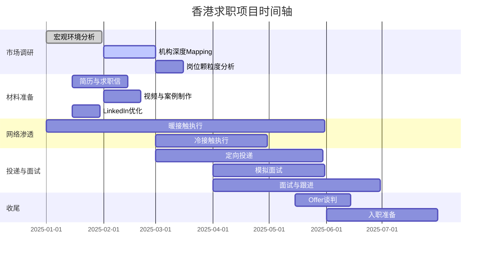

# 香港心理学硕士毕业生求职行动方案
**执行对象：何振豪（Zhenhao He）**  
**目标岗位：香港国际学校校本辅导员 / NGO心理健康项目主任**  
**执行周期：2025年1月 - 2025年8月（入职）**  
**方案版本：v1.0**

---

## 一、项目概述

### 1.1 核心目标
- 在2025年5月毕业前锁定至少2个香港国际学校或NGO的口头offer
- 起薪目标：HKD 28,000-45,000/月
- 建立可持续的香港本地化职业发展路径

### 1.2 关键成功要素
- **差异化定位**：美国训练 + 香港国际学校背景 + 双语母语 + 南亚服务经验
- **执照规避**：优先申请无法律执照要求的School Counselor/项目主任岗
- **关系网络**：利用校友身份和国际学校体系内部人脉突破"海投"低效困境

---

## 二、市场调研模块

### 2.1 宏观市场环境调研
**执行周期：2025年1月1日 - 1月31日**  
**负责人：市场研究顾问**

#### 任务清单
- [ ] **政策文件收集**：获取香港教育局2024-25学年《国际学校心理健康服务指引》全文，标注校本辅导员配置强制要求条款
- [ ] **行业报告分析**：购买/获取香港社会服务联会《2024精神健康服务人力需求报告》，提取NGO薪资中位数与岗位增长率数据
- [ ] **薪资数据库搭建**：收集Glassdoor、CTgoodjobs、JobsDB三大平台近6个月"School Counselor"、"心理健康辅导员"、"项目主任"薪资样本各30条，建立薪酬分布热力图
- [ ] **竞争对手分析**：LinkedIn搜索"香港国际学校+Counselor"，整理现任者学历背景（统计美国硕士占比）、平均任期、跳槽频率

**交付物**：20页《香港心理服务市场宏观环境分析报告》（含政策摘要、薪资基准线、竞争格局地图）

---

### 2.2 中观机构/学校深度Mapping
**执行周期：2025年2月1日 - 2月28日**  
**负责人：机构研究顾问**

#### 2.2.1 国际学校A-list清单（优先级Tier 1）
| 学校名称 | 调研任务 | 执行动作 |
|---------|---------|---------|
| **汉基国际学校（CIS）** | ① 联系现任Counselor团队3人（LinkedIn/InMail）<br>② 获取学校年度心理健康服务报告（公开渠道/校友）<br>③ 统计校内普通话家庭比例 | 制作《CIS心理健康服务架构图》，标注潜在合作部门（如Learning Support） |
| **香港国际学校（HKIS）** | ① 分析学校官网Counseling页面，提取服务模型（responsive vs proactive）<br>② 查找HKIS教职工EAP服务供应商，评估转岗机会 | 输出《HKIS岗位需求预测：2025-26学年扩建计划关联性分析》 |
| **弘立书院（ISF）** | ① 联系校友会获取内推渠道<br>② 研究其双语IB课程的心理支持痛点 | 制作《ISF双语学生文化适应问题案例库》（用于面试） |

#### 2.2.2 NGO机构Mapping（备选渠道）
- [ ] **机构筛选**：从香港社会服务联会会员列表中，筛选20家提供长者/儿童心理服务的NGO（预算规模>HKD 500万）
- [ ] **项目分析**：深度拆解其中5家机构的"行为健康外展"项目模式，对标你的Ethos实习经验
- [ ] **人脉渗透**：找到每家机构的Program Director或HR Manager的LinkedIn档案，建立联系数据库（含共同联系人）

**交付物**：
- 《香港8所目标学校/机构组织架构与决策链图谱》（标注谁有招聘决定权）
- 《5家高匹配NGO项目主任岗位隐性要求清单》（通过现任者访谈获取）

---

### 2.3 微观岗位需求颗粒度分析
**执行周期：2025年3月1日 - 3月15日**  
**负责人：岗位分析顾问**

#### 核心任务
- [ ] **JD逆向工程**：收集至少15份School Counselor/项目主任岗位描述，提取高频关键词（如SEL, restorative practice, safeguarding），建立"简历关键词匹配度检查清单"
- [ ] **痛点访谈**：通过校友/LinkedIn完成5位现任国际学校辅导员的20分钟语音访谈，获取未公开的KPI（如"家长投诉率低于5%"、"学生自伤事件响应时效<2小时"）
- [ ] **胜任力模型构建**：基于访谈，绘制目标岗位的"理想候选人画像"，标注你的经验缺口与弥补方案（如缺"粤语危机干预"→安排模拟训练）

**交付物**：《香港国际学校Counselor岗位隐性胜任力模型》（含3大硬技能+5大软技能+2项文化资本）

---

## 三、求职策略与执行方案

### 3.1 个人品牌定位与材料重构
**执行周期：2025年1月15日 - 2月15日**  
**负责人：职业发展顾问 + 文案顾问**

#### 3.1.1 核心定位语（Elevator Pitch）
**中文**："美国咨询心理学硕士 + 香港国际学校校友 + 双语（粤/普/英）母语者，专长跨文化老年及儿童心理健康，能将前沿循证干预融入香港社区与学校场景"

**英文**："HK International School Alum with US Counseling Psych training, trilingual in Cantonese/Mandarin/English. Bridging evidence-based geriatric & child mental health practices to HK's multicultural settings."

#### 3.1.2 材料清单与制作标准
| 材料类型 | 内容要求 | 交付日期 | 负责人 |
|---------|---------|---------|--------|
| **简历（香港版）** | 1页双语（英+普），关键词匹配JD>85%，附二维码链接至3分钟视频简介 | 2025-02-01 | 文案顾问 |
| **求职信模板** | 3个版本（国际学校/NGO/备选），每版300词，含定制化"痛点解决方案"段落 | 2025-02-08 | 文案顾问 |
| **视频自我介绍** | 3分钟，三语混剪（英文70%+普通话30%），专业背景+香港情怀+服务案例 | 2025-02-15 | 视频制作顾问 |
| **案例简报** | 1份脱敏危机干预案例（英文），展示评估-干预-评估闭环，适配学校场景 | 2025-02-20 | 职业发展顾问 |
| **LinkedIn档案** | Headline/Summary/Experience全部重写，关键词优化，开启"Open to Work"可见性 | 2025-01-31 | 个人品牌顾问 |

**交付物**：全套求职材料（PDF+视频+LinkedIn）及《使用场景说明》（何时用哪个版本）

---

### 3.2 关系网络渗透计划
**执行周期：贯穿2025年1月-5月**  
**负责人：人际关系顾问**

#### 3.2.1 暖接触（Warm Outreach）矩阵
| 目标对象 | 接触方式 | 话术要点 | 频率 | 成功指标 |
|---------|---------|---------|------|---------|
| **NEU香港校友** | LinkedIn搜索"Northeastern+HK+Psychology"，10人 | "校友+同专业+回港求职" | 每周2人 | 至少3人回复，1人转介绍 |
| **国际学校旧师** | 邮件/LinkedIn联系升学顾问/心理老师5人 | "学生回校服务+请教行业洞察" | 一次性批量 | 2人愿意内部推荐 |
| **2023香港实习主管** | 邮件+Zoom catch-up | "汇报NEU学习成果+表达回港意向" | 2025-01-31前完成 | 获得推荐信或岗位线索 |
| **现任Counselor** | LinkedIn InMail（附简历）+ 15分钟coffee chat请求 | "同行学习+特定学校痛点调研" | 每周1人 | 5人中至少1人提供"内部信息" |

#### 3.2.2 冷接触（Cold Outreach）策略
- [ ] **招聘官定向投递**：找到8所目标学校HR总监邮箱（官网/LinkedIn），发送"价值前置"邮件（附件为《香港国际学校学生心理健康趋势简报》而非简历），建立专业形象后再跟进
- [ ] **行业活动渗透**：报名2025年3月香港国际学校协会（AISHK）年会，作为"NEU研究生"申请学生折扣票，现场交换20张名片

**交付物**：
- 《暖接触进度追踪表》（含联系人、关系强度、最近一次互动、下一步行动）
- 《30天LinkedIn互动计划》（每日点赞/评论/转发目标）

---

### 3.3 渠道投放与机会捕捉
**执行周期：2025年3月1日 - 5月31日**  
**负责人：求职执行顾问**

#### 3.3.1 主渠道（优先级排序）
1. **内部推荐**（目标占比60%）：通过校友、实习主管、国际学校旧师获取内推
2. **定向投递**（30%）：目标学校官网直接投递，抄送部门主管个人邮箱
3. **招聘平台**（10%）：JobsDB、LinkedIn Jobs设置"School Counselor + Hong Kong"自动提醒

#### 3.3.2 投递节奏
| 月份 | 投递目标 | 跟进策略 | 预期面试数 |
|---------|---------|---------|-----------|
| **3月** | 国际学校5所 + NGO 3家 | 投递后48小时内LinkedIn InMail跟进 | 2-3次 |
| **4月** | 国际学校8所 + NGO 5家 | 每周五批量发送"求职进展更新"给所有联系人 | 3-4次 |
| **5月** | 清票（所有未投目标）+ 跟进waiting list | 对心仪岗位发送"补充材料"（如粤语服务案例） | 2-3次 |

**交付物**：《投递日志》（机构/日期/岗位/决策链/状态/备注）

---

### 3.4 面试准备体系
**执行周期：2025年3月15日 - 5月31日**  
**负责人：面试教练**

#### 3.4.1 场景化问题库
- **高频问题**：准备20个标准问题答案（行为面试法STAR），每题配中英双语版本
- **学校专属问题**：
  - "如何处理内地家长与外籍班主任关于学生心理评估的文化冲突？"
  - "请用粤语模拟安慰一位因学业压力自残的Form 5学生"
- **NGO专属问题**：
  - "如何评估香港长者对行为健康外展服务的接受度？你的美国经验如何本土化？"

#### 3.4.2 模拟面试安排
| 模拟类型 | 面试官 | 时间 | 反馈重点 |
|---------|--------|------|---------|
| **国际学校版** | 聘请前任国际学校Counselor（通过LinkedIn） | 2025-04-10 | 文化契合度、语言切换流畅度 |
| **NGO版** | 联系香港NGO项目主任（校友网络） | 2025-04-20 | 项目逻辑、社区资源链接能力 |
| **压力面** | 职业发展顾问扮演外籍校长 | 2025-05-01 | 执照短板回应、薪资预期管理 |

**交付物**：
- 《面试问题库与标准答案》（中英对照，附粤语拼音标注）
- 《3次模拟面试录像与逐字稿分析》

---

## 四、时间轴与里程碑

### 4.1 甘特图（关键路径）


### 4.2 关键里程碑（Go/No-Go决策点）
| 日期 | 里程碑 | 成功标准 | 若未达成补救措施 |
|---------|---------|---------|----------------|
| **2025-01-31** | 完成宏观报告+LinkedIn优化 | 获得3位NEU校友回复 | 延长暖接触周期，增加5个目标联系人 |
| **2025-02-28** | 8所目标学校Mapping完成+材料定稿 | 至少1所学校的现任Counselor愿意15分钟通话 | 转向NGO渠道，调整定位语 |
| **2025-03-31** | 投递10个岗位+完成2次模拟面试 | 获得至少1次面试邀约 | 复盘材料，强化痛点解决方案部分 |
| **2025-04-30** | 累计面试5次 | 至少1个岗位进入终面 | 扩大投递范围至15所学校，调整薪资预期 |
| **2025-05-20** | 锁定≥2个口头Offer | 薪资达到目标下限 | 若只有1个Offer，延长执行期至6月 |

---

## 五、资源配置与预算

### 5.1 人力配置
| 角色 | 职责 | 工时估算 | 预算（USD） |
|------|------|---------|------------|
| 市场研究顾问 | 宏观报告 + 行业数据分析 | 40小时 | 2,000 |
| 机构研究顾问 | 学校/NGO Mapping + 访谈执行 | 60小时 | 3,000 |
| 职业发展顾问 | 定位策略 + 面试辅导 | 30小时 | 2,500 |
| 文案顾问 | 简历/求职信/案例撰写 | 20小时 | 1,500 |
| 视频制作顾问 | 3分钟视频拍摄与剪辑 | 10小时 | 800 |
| 人际关系顾问 | 网络渗透策略 + LinkedIn运营 | 15小时 | 1,200 |
| **合计** | | **175小时** | **$11,000** |

### 5.2 工具与平台订阅
- **LinkedIn Premium**：$29.99/月 × 5个月 = $150
- **Zoom Pro**：$14.99/月 × 5个月 = $75（模拟面试录制）
- **Canva Pro**：$12.99/月 × 2个月 = $26（视觉材料制作）
- **香港心理学会学历评估费**：HKD 2,000（约 $260）

**总预算：$11,511**

---

## 六、风险管理

### 6.1 风险矩阵
| 风险描述 | 概率 | 影响 | 应对策略 |
|---------|------|------|---------|
| 香港国际学校冻结招聘 | 30% | 高 | 启动NGO备选方案（3月底前完成Mapping） |
| 薪资低于预期20%以上 | 40% | 中 | 谈判时强调"6个月试用期后review"，靠绩效提升 |
| 粤语口语面试表现不佳 | 25% | 高 | 3月起每周2次粤语模拟面试，覆盖10大场景 |
| 内推渠道失效 | 20% | 中 | 主渠道转向定向投递，每周至少3封精准邮件 |
| 执照问题被雇主质疑 | 50% | 中 | 准备标准回应话术，强调岗位无需执照+已启动HKPS副会员申请 |

---

## 七、成功指标与KPI

### 7.1 过程指标（Process KPI）
- 暖接触回复率 > 40%
- 定向投递后面试转化率 > 25%
- 模拟面试平均评分 > 8.5/10

### 7.2 结果指标（Outcome KPI）
- 2025年5月31日前获得 **≥2个书面Offer**
- 起薪中位数 **≥HKD 32,000**
- 岗位与职业目标匹配度 **≥90%**

---

## 八、附录

### 8.1 核心联系人数据库模板
```excel
| 姓名 | 机构 | 职位 | 关系强度 | 上次互动 | 下一步行动 | 拥有信息 |
|------|------|------|---------|---------|-----------|---------|
| 张XX | CIS | Head of Counseling | 校友（间接） | 2025-01-15 | 发送InMail | 邮箱: zhangxx@cis.edu.hk |
```

### 8.2 访谈问题清单（供机构研究顾问使用）
1. 您校Counselor团队最大的挑战是什么？（学生/家长/制度层面）
2. 招聘时最看重候选人的哪段经验？（请排序）
3. 内地生源增长是否带来新需求？具体表现？
4. 对美国硕士学历候选人有何顾虑？
5. 能否接受无香港执照但承诺2年内考取？

---

**项目负责人签字**：_________________  
**日期**：2025-01-17  
**方案有效期**：2025年1月 - 2025年8月

---

*此方案为可执行级文档，所有任务均可分解为具体行动项并分配至个人。建议每周五下午召开30分钟项目进度 sync 会议，确保关键路径无延误。*